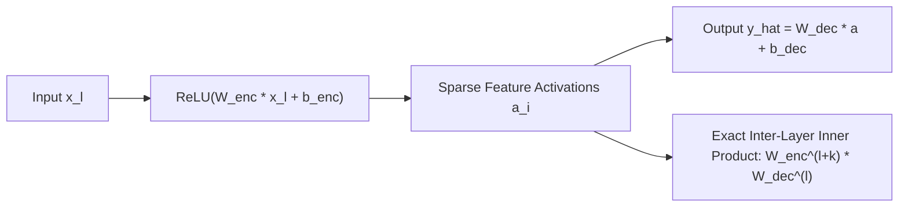

# Transcoders & Linearized Feature Circuit Attribution Graphs

## Transcoders vs. Sparse Autoencoders (SAEs)
Standard Sparse Autoencoders (SAEs) act as identity autoencoders ($\hat{x} \approx x$), mapping an activation vector $x \in \mathbb{R}^d$ into an overcomplete sparse feature dictionary. While SAEs isolate monosemantic features within static snapshots (e.g., residual streams), they treat multi-layer perceptron (MLP) layers as opaque, non-linear black boxes: $\text{MLP}(x) = W_2\,\sigma(W_1 x + b_1)$.

**Transcoders** (Dunefsky et al., NeurIPS 2024; Anthropic Transformer Circuits) replace identity autoencoding with functional module translation, predicting the non-linear transformation $y = \text{MLP}(x)$ directly from module inputs $x$:
$$f(x) = W_{\text{dec}}\,\operatorname{ReLU}(W_{\text{enc}} x + b_{\text{enc}}) + b_{\text{dec}}$$
where latent features are constrained to be sparse via $L_1$, TopK, or JumpReLU regularization, with $W_{\text{dec}} \in \mathbb{R}^{d \times M}$ and $M \gg d$.

## Linearizing Multi-Layer Perceptrons
By replacing $\text{MLP}(x)$ with $f(x) = \sum_{i=1}^M a_i(x)\,W_{\text{dec}, i} + b_{\text{dec}}$, where $a_i(x) = [\operatorname{ReLU}(W_{\text{enc}} x + b_{\text{enc}})]_i$ is the scalar activation of latent $i$, internal MLP non-linearities are completely eliminated.

The network’s computation is linearized:
- Active latents write directly into the residual stream along sparse dictionary directions $W_{\text{dec}, i}$.
- Downstream feature $j$ at layer $l+k$ reads from the residual stream via encoder row $W_{\text{enc}, j}^{(l+k)}$.
- Direct causal attribution simplifies to an exact linear inner product:
  $$A_{i \to j} = a_i^{(l)}\,\left( W_{\text{enc}, j}^{(l+k)} W_{\text{dec}, i}^{(l)} \right)$$

This transforms the entire Transformer into a transparent Directed Acyclic Graph (DAG) of interpretable feature circuits.

Related: [[crosscoders_and_transcoders]], [[topk_sparse_autoencoders]], [[loreft_representation_fine_tuning]]
