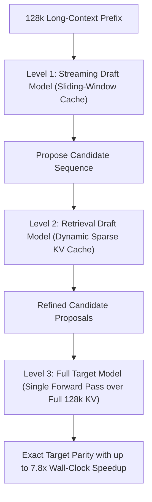

# TriForce: Hierarchical Long-Context Speculative Decoding

TriForce (Sun et al., 2024) solves the memory-bandwidth bottleneck of speculative decoding over 128k context windows using a two-level drafting hierarchy.

## Core Mechanics
1. **The Long-Context Speculative Bottleneck:** Standard speculative decoding fails over $100\text{K}+$ contexts because transferring massive KV caches for draft models saturates GPU memory bandwidth.
2. **Hierarchical Drafting Hierarchy:**
   - *Level 1 (Streaming Drafter):* Employs a lightweight draft model with a constant-size sliding window cache to generate initial candidate tokens with zero memory transfer overhead.
   - *Level 2 (Retrieval Drafter):* Reuses target model weights over dynamically retrieved sparse KV cache subsets to filter and refine candidate tokens.
   - *Level 3 (Target Verification):* Validates the refined tokens against the full 128K KV cache in a single forward pass.
3. **Lossless Acceleration:** Guarantees mathematically exact target model output distributions while achieving **up to $7.8\times$ serving throughput speedups**.

Related: [[medusa_speculative_tree_attention]], [[kangaroo_self_speculative_subnetwork]], [[eagle2_recurrent_feature_speculation]], [[duoattention_retrieval_streaming_heads]]
