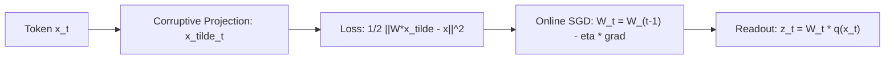

# Test-Time Training (TTT) Layers

## Redefining RNN Hidden States as Machine Learning Models
Linear attention and recurrent models (Mamba, RWKV) achieve linear complexity $\mathcal{O}(N)$ and constant $\mathcal{O}(1)$ memory decoding, but their bounded vector states saturate over long contexts.

**Test-Time Training (TTT)** (Sun et al., Stanford, UC Berkeley, UCSD, Meta 2024 / arXiv:2407.04620) redefines the RNN hidden state as an **actual machine learning model** $W_t$. The state transition rule is an online gradient descent step on a self-supervised reconstruction objective evaluated on incoming sequence tokens.

## Mathematical Formulation of TTT
1. **Hidden State as Model:** State $W_t \in \mathbb{R}^{d_1 \times d_2}$ (TTT-Linear) or MLP weights $\Theta_t$ (TTT-MLP).
2. **Self-Supervised Loss:** Given input token $x_t$ and feature view $\tilde{x}_t$:
   $$\ell(W; x_t) = \frac{1}{2} \| W \tilde{x}_t - x_t \|^2$$
3. **Hidden State Update Rule:**
   $$W_t = W_{t-1} - \eta \nabla_W \ell(W_{t-1}; x_t)$$
4. **Token Readout:**
   $$z_t = W_t \cdot \operatorname{LayerNorm}(q(x_t))$$

## Long-Context Extrapolation
Unlike Mamba or Transformers that plateau or degrade when extrapolated beyond pretraining lengths, TTT layers monotonically decrease perplexity as context scales to $32\text{k}\text{--}128\text{k}$ tokens while retaining linear training and constant decoding footprint.

Related: [[kv_cache_optimizer]], [[gated_linear_attention_transformers]], [[speculative_decoding_specialist]]
