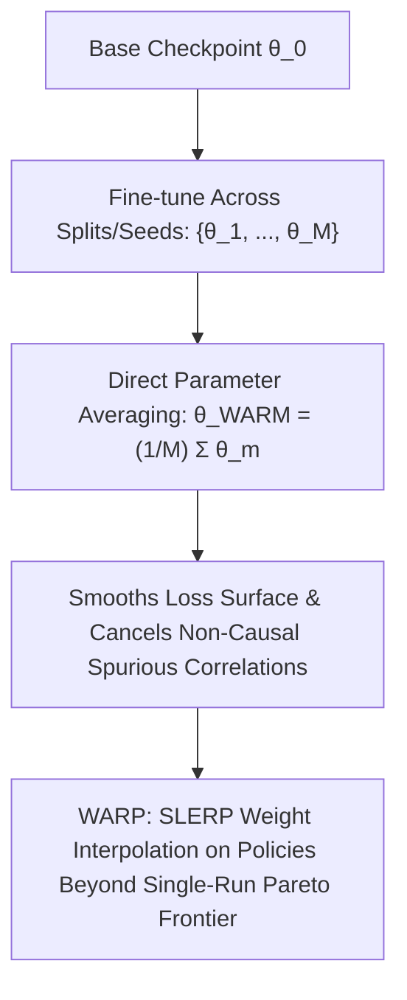

# WARM & WARP: Weight-Averaged Reward Models & Policies

**WARM** (Weight-Averaged Reward Models) and **WARP** (Weight-Averaged Reward-trained Policies; Ramé et al., Google DeepMind, 2024) exploit linear mode connectivity to suppress Goodhart's law / reward hacking by merging model checkpoints directly in weight space rather than ensembling predictions at inference time.

## Mathematical Formalism
1. **Weight Averaging over Mode Connectivity:**
   $$\theta_{\text{WARM}} = \frac{1}{M} \sum_{m=1}^M \theta_m$$
   Averaging eliminates individual model errors $\mathbb{E}[\epsilon_{\text{WARM}}] \to 0$, smoothing the reward landscape and delaying Goodhart reward collapse with zero inference latency overhead.
2. **Policy Interpolation (SLERP):**
   $$\theta_{t+1} = \text{SLERP}\left(\theta_t, \theta_{\text{new}}, \alpha\right) = \frac{\sin((1 - \alpha)\Omega)}{\sin \Omega} \theta_t + \frac{\sin(\alpha \Omega)}{\sin \Omega} \theta_{\text{new}}$$
   where $\cos \Omega = \frac{\langle \theta_t, \theta_{\text{new}} \rangle}{\|\theta_t\| \|\theta_{\text{new}}\|}$.
   WARP pushes language models beyond the classical RLHF Pareto frontier, boosting AlpacaEval 2.0 win rates without catastrophic forgetting or distribution collapse.

## Related Mechanics
- [[reward_overoptimization_goodhart_law]]
- [[reinforcement_learning_human_feedback]]
- [[direct_preference_optimization_dpo]]
- [[model_merging_mechanics]]
