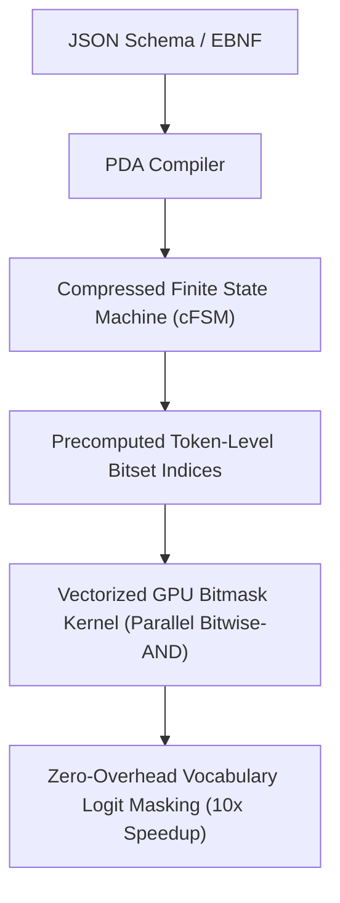

# XGrammar: Hardware-Accelerated Grammar Decoding

XGrammar (Zhao et al., MLC.ai / CMU 2024) eliminates runtime latency bottlenecks in grammar-constrained LLM decoding via compressed automata representations and vectorized GPU bitmask kernels.

## Core Mechanics
1. **Compressed Finite State Machine (cFSM):** Compiles context-free grammars and JSON schemas into compressed transition tables, pruning redundant intermediate states and synchronizing subword token boundaries offline.
2. **Parallel GPU Bitmask Vectorization:** Replaces slow, sequential CPU parsing loops with parallel GPU bitmask operations. Valid next-token continuations are encoded as packed 32-bit/64-bit integer bitsets, applying logit masks via direct parallel vectorized bitwise operations:
   $$M_{\text{vocab}} = \text{BitwiseAnd}\left(\text{PrecomputedStateMask}(s), \text{VocabularyIndex}\right)$$
3. **Cross-Engine Portability:** Integrates natively with zero copy across vLLM, SGLang, TensorRT-LLM, and MLC-LLM, reducing per-token grammar overhead from milliseconds to microseconds.

## Benchmark Performance
- Delivers up to **$10\times$ higher token serving throughput** compared to traditional regex/CPU-based constrained decoding engines.
- Guarantees strict 100% schema compliance for function calling, structured tool use, and Pydantic data extraction.

Related: [[syncode_grammar_guided_decoding]], [[domino_grammar_speculative_decoding]], [[outlines_dfa_constrained_decoding]]
