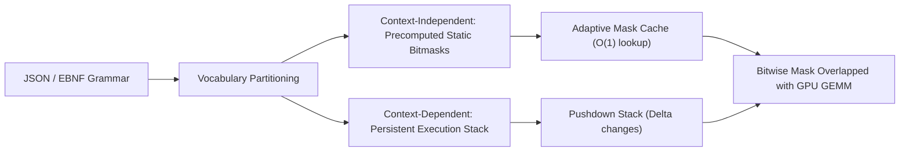

# XGrammar: Zero-Overhead Grammar-Constrained Decoding

## The Constrained Decoding Latency Tax
Grammar-constrained decoding (JSON schema, EBNF, SQL) forces LLMs to adhere strictly to formal grammars. However, traditional DFA/Trie parsers (Outlines, Guidance) introduce $5\text{--}50\text{ ms}$ CPU overhead per token to compute valid vocabulary bitmasks, eclipsing GPU forward compute time and degrading serving throughput by $3\times\text{--}10\times$.

**XGrammar** (Dong et al., MLSys 2025 / arXiv:2411.15100) eliminates this bottleneck via vocabulary partitioning and GPU-CPU pipelined execution, delivering up to **$100\times$ speedups** with sub-microsecond masking overhead.

## Architectural Innovations
1. **Vocabulary Partitioning:**
   - **Context-Independent Tokens ($\mathcal{V}_{\text{indep}}$):** Syntactically fixed tokens (e.g., JSON structural characters `true`, `false`, `null`, delimiters `,`, `{`, `}`). Validity is precomputed offline into 32-bit bitset masks. Runtime evaluation is an $\mathcal{O}(1)$ pointer dereference.
   - **Context-Dependent Tokens ($\mathcal{V}_{\text{dep}}$):** Dynamic tokens (e.g., string literals, numbers) managed by a pushdown automaton with a **Persistent Execution Stack** that pushes/pops only state deltas.
2. **GPU Kernel Overlap:**
   Grammar state evaluation is asynchronously pipelined on CPU/host while the GPU executes current-token Tensor Core GEMMs, eliminating execution bubbles.

## Serving Impact
Integrated into SGLang and vLLM, XGrammar slashes per-token masking latency from **$32.4\text{ ms} \to 0.18\text{ ms}$** on complex JSON schemas, achieving near-zero overhead structured inference.

Related: [[constrained_decoding_architect]], [[kv_cache_optimizer]], [[token_healing_subword_boundary_synchronization]]
