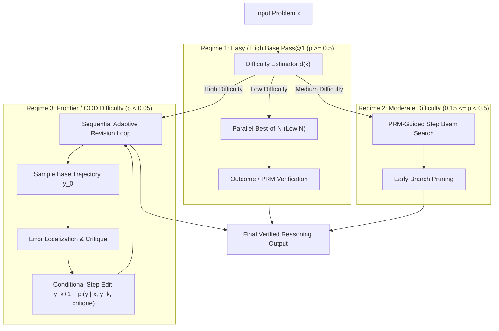

# Test-Time Compute Optimal Scaling & Verifier vs. Revision Trade-Offs (Snell et al., 2024)

## 1. Executive Summary & The Inference Scaling Paradigm
Classical neural scaling laws (Kaplan et al., 2020; Chinchilla, Hoffmann et al., 2022) established that model capability scales as a power-law function of pretraining parameters $N$ and dataset token count $D$. However, as pretraining data reaches planetary exhaustion and frontier cluster training incurs steep capital costs, the primary frontier of capability scaling has shifted toward **inference-time / test-time compute (TTC)**.

Charlie Snell, Jaehoon Lee, Kelvin Xu, and Aviral Kumar (*Scaling LLM Test-Time Compute Optimally can be More Effective than Scaling Model Parameters*, UC Berkeley & Google DeepMind, 2024 / arXiv:2408.03314) formalize the equivalence between pretraining FLOPs and test-time FLOPs, proving that for complex mathematical, algorithmic, and symbolic reasoning tasks:
$$\text{FLOPs}_{\text{total}} = \text{FLOPs}_{\text{pretrain}} + Q \cdot \text{FLOPs}_{\text{test-time}}$$
where $Q$ is query volume. Crucially, Snell et al. demonstrate that spending inference FLOPs dynamically conditioned on problem difficulty enables smaller, parameter-efficient models to match or exceed models with up to **$14\times$ more parameters**.



---

## 2. The Two Orthogonal Axes of Test-Time Compute

Test-time compute can be expended along two distinct, complementary dimensions:

### 2.1 Verifier-Guided Search (Parallel Best-of-$N$ & Step-Level Beam Search)
In verifier-guided search, the generator policy $\pi_\theta(y \mid x)$ produces candidate reasoning trajectories that are scored and selected by an independent Process Reward Model (PRM) or Outcome Reward Model (ORM):
$$\hat{y} = \operatorname{argmax}_{y^{(i)} \in \{y^{(1)}, \dots, y^{(N)}\}} \mathcal{R}_{\text{verifier}}\left(x, y^{(i)}\right)$$

- **Coverage Dynamics:** For independent and identically distributed (i.i.d.) samples, the probability of generating at least one correct solution within $N$ parallel draws is:
  $$P_{\text{success}}(N) = 1 - (1 - p)^N$$
  where $p = P(y \in \mathcal{Y}^* \mid x)$ is the model's base single-pass accuracy (pass@1).
- **Diminishing Returns & Saturation:**
  As $N \to \infty$, $P_{\text{success}}(N) \to 1$ *only if* $p > 0$. When problems are beyond the latent parametric capability of the base policy (i.e., $p \approx 0$), drawing $10^4$ independent samples yields zero valid candidates.
- **Verifier Goodharting:** With large $N$, the likelihood of sampling an adversarial or specious trajectory that tricks the verifier (a false positive) increases monotonically, eventually degrading test accuracy at extreme sample counts.

### 2.2 Adaptive Sequence Revisions (Sequential Local Correction)
In adaptive revision, the model iteratively edits and refines its intermediate reasoning steps conditioned on internal verification or external execution feedback:
$$y^{(k+1)} \sim \pi_{\text{revise}}\left(y \mid x, y^{(k)}, c^{(k)}\right)$$
where $c^{(k)}$ is a natural language critique or error localization signal.

- **Transition Fine-Tuning:** The revision policy $\pi_{\text{revise}}$ is fine-tuned on paired trajectories where an initial incorrect derivation is mapped to a verified correct derivation: $(x, y_{\text{incorrect}}, c) \to y_{\text{correct}}$.
- **Local Neighborhood Exploration:** Unlike parallel sampling which restarts from the root prompt on every iteration, sequential revision preserves valid preliminary steps and performs targeted surgical edits on flawed nodes, exploring solution spaces completely inaccessible to zero-shot greedy decoding.

---

## 3. Prompt Difficulty-Conditioned Compute Optimality

The cornerstone empirical finding of Snell et al. is that **there is no universally optimal search strategy**. The Pareto-optimal allocation of inference FLOPs is fundamentally governed by the problem's underlying difficulty $d(x)$:

| Problem Difficulty Regime | Base Single-Pass Pass@1 ($p$) | Compute-Optimal Search Topology | Failure Mode of Alternative Approaches |
| :--- | :--- | :--- | :--- |
| **Easy Problems** | $p \ge 0.5$ | **Parallel Best-of-$N$ (Low $N \in [2, 8]$)** | Step-level beam search and revisions incur unnecessary latency and token overhead with zero accuracy gain. |
| **Intermediate Problems** | $0.15 \le p < 0.5$ | **PRM-Guided Beam Search / Tree Search** | Independent Best-of-$N$ duplicates early reasoning prefixes; PRM beam search prunes dead branches at step $t_k$. |
| **Hard / Frontier Problems** | $p < 0.05$ | **Sequential Adaptive Revisions** | $p$ is too small for Best-of-$N$ to generate even one valid solution within reasonable compute limits ($N > 10^3$); revision modifies unreachable latent paths. |

### 3.1 Mathematical Derivation of Difficulty-Adaptive Gains
Let $C(M, x)$ denote the computational cost in FLOPs required to achieve target probability of correctness $P^*$ on query $x$ using search method $M \in \{\text{BoN}, \text{Beam}, \text{Revise}\}$.
Under uniform allocation, the system applies fixed $M_{\text{fixed}}$ across all queries, resulting in average expenditure:
$$\bar{C}_{\text{uniform}} = \mathbb{E}_{x \sim \mathcal{D}}[ C(M_{\text{fixed}}, x) ]$$
Under compute-optimal adaptive routing:
$$\bar{C}_{\text{optimal}} = \mathbb{E}_{x \sim \mathcal{D}}\left[ \min_{M} C(M, x) \right]$$
Because $C(\text{BoN}, x) \ll C(\text{Revise}, x)$ on easy prompts, and $C(\text{Revise}, x) \ll C(\text{BoN}, x)$ on hard prompts, Jensen's inequality and empirical evaluation establish that:
$$\bar{C}_{\text{optimal}} \le \frac{1}{4} \bar{C}_{\text{uniform}}$$
delivering a **$>4\times$ reduction in inference compute** for identical aggregate benchmark accuracy.

---

## 4. Parameter Equivalence & The Pretraining-Inference Trade-off

Snell et al. evaluate this compute-optimal framework across MATH, GSM8K, and Codeforces, establishing a direct trade-off curve between static model parameters and dynamic inference tokens:

```
Accuracy (%)
  ^
  |                                        [7B + Compute-Optimal TTC] (Matches 70B!)
  |                                     *
  |                              *
  |                       *
  |             *   [70B Single-Pass Baseline]
  |       *
  |   *   [7B Single-Pass Baseline]
  +----------------------------------------------------> Test-Time Compute (FLOPs)
```

- **14× Parameter Parity:** A **PaLM-2 / LLaMA-3 7B** base model equipped with compute-optimal test-time search matches or exceeds the accuracy of a **70B parameter model** evaluated via standard greedy or low-temperature decoding.
- **Economic Inversion:** For low-to-medium query volume services, serving a 7B model with expanded test-time reasoning is dramatically cheaper in hardware deployment, KV-cache residency, and memory bandwidth than serving a distributed 70B+ cluster.

---

## 5. Architectural Implications for Frontier Reasoning Models (o1 / o3 / R1)

The theoretical framework established by Snell et al. directly explains the empirical behavior observed in state-of-the-art reasoning models:
1. **Dynamic Thinking Budgets:** Models like OpenAI o1/o3 and DeepSeek-R1 allocate variable reasoning token lengths ($\approx 500$ tokens for simple arithmetic vs $15,000+$ tokens for Olympiad geometry).
2. **Autonomous Error Backtracking:** As seen in DeepSeek-R1-Zero's "Aha moments," test-time reinforcement learning (RLVR/GRPO) organically learns to interleave generation with verification and self-revision tokens (`"Wait, let me recalculate position 3..."`), manifesting the adaptive revision mechanism discovered by Snell et al. without external search scaffolding.

---

## 6. Implementation Directives for Autonomous Engineering
- When deploying test-time compute pipelines:
  1. Never deploy static $N$ Best-of-$N$ across heterogeneous query distributions.
  2. Implement an initial step-entropy or lightweight classifier to estimate task difficulty $d(x)$.
  3. Route easy tasks ($d < \tau_1$) to parallel Best-of-$N$ with outcome verification.
  4. Route hard tasks ($d \ge \tau_1$) to iterative revision loops governed by verified process reward models (PRMs).
