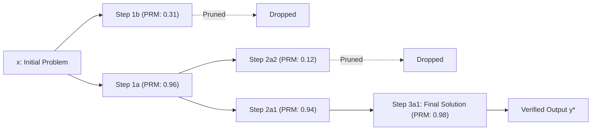
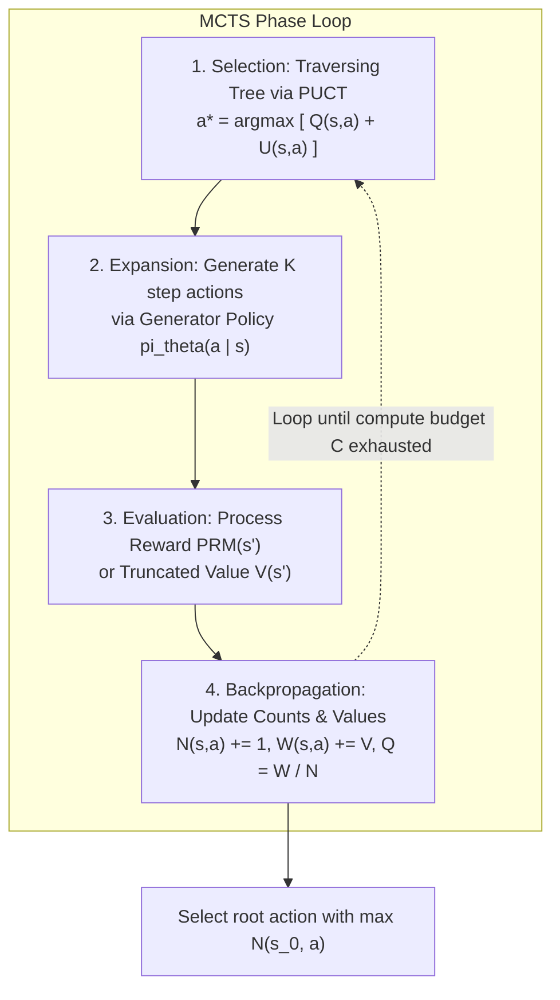
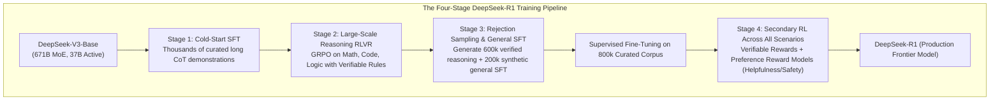
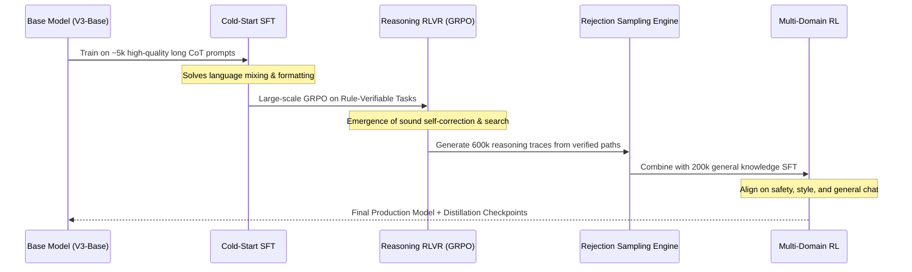
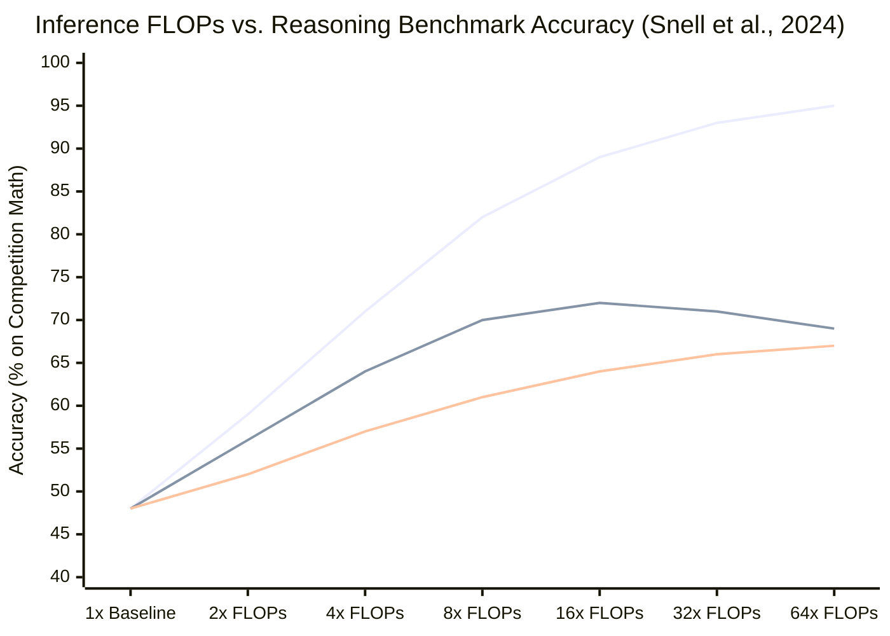
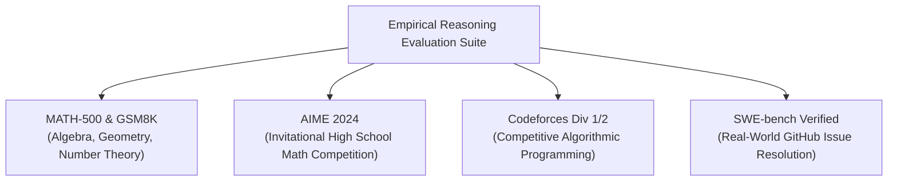
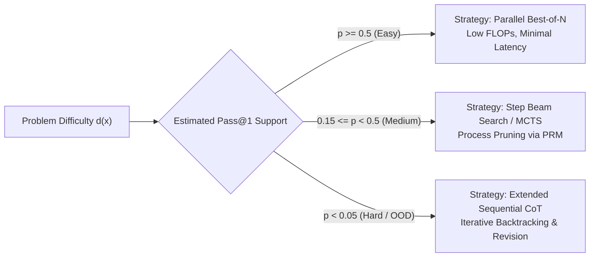

# Test-Time Compute Scaling, Process Reward Models, and Reinforcement Learning from Verifiable Rewards (RLVR)

**Authoritative Technical Monograph & Reference Architecture**  
**Autonomous Research & Alignment Directives Vault**  
**Classification: Frontier Model Reasoning, Inference Scaling & Post-Training Alignment**

---

## Abstract

For nearly a decade, frontier artificial intelligence capabilities were governed by empirical pre-training scaling laws (Kaplan et al., 2020; Chinchilla, Hoffmann et al., 2022), which dictated that downstream cross-entropy loss and task performance scale as a power-law function of parameter count $N$, pre-training dataset size $D$, and total pre-training FLOPs $C_{\text{pretrain}} \approx 6ND$. As high-quality human linguistic tokens approach asymptotic planetary depletion and the marginal cost of pre-training clusters escalates super-linearly, the frontier of language model steerability and cognitive capability has undergone a profound paradigm shift: **Test-Time Compute (TTC) Scaling**.

This monograph presents a rigorous, publication-grade theoretical and empirical treatise on test-time compute scaling, step-level process supervision, and reinforcement learning from verifiable rewards (RLVR). We formulate the dual axes of inference compute—parallel search (Best-of-$N$, majority voting) and sequential deliberative expansion (long Chain-of-Thought, internal backtracking, adaptive revision)—and derive their information-theoretic and probabilistic bounds under noisy verifiers. We provide full mathematical treatments of Process Reward Models (PRMs), step-level beam search, and Monte Carlo Tree Search (MCTS) parameterized by Upper Confidence Bounds for Trees (PUCT). 

Furthermore, we deconstruct Reinforcement Learning from Verifiable Rewards (RLVR), providing an exact derivation of Group Relative Policy Optimization (GRPO), examining the elimination of critic networks, and detailing the suppression of reward hacking through deterministic rule-based verification. We synthesize the architectural mechanics of OpenAI's o1/o3 and DeepSeek-R1, documenting the spontaneous emergence of metacognitive self-correction ("the Aha! moment") without supervised demonstrations. Finally, we provide a unified benchmark analysis across MATH, GSM8K, Codeforces, AIME, and SWE-bench, concluding with an analysis of test-time Pareto optimality, asymmetric verification complexity, and open theoretical frontiers.

---

## 1. Executive Abstract & Theoretical Foundations: Test-Time Compute vs. Pre-Training Scaling

### 1.1 The Exhaustion of the Pre-Training Frontier
The classical Chinchilla scaling regime established an optimal balance between model parameters $N$ and token volume $D$ under compute budget $C$:
$$C = 6ND \implies N_{\text{opt}} \propto C^{0.5}, \quad D_{\text{opt}} \propto C^{0.5}$$
Under this regime, reducing test loss $\mathcal{L}(N, D)$ requires increasing both parameter scale and pre-training data volume:
$$\mathcal{L}(N, D) = E + \frac{A}{N^\alpha} + \frac{B}{D^\beta}$$
where $E$ denotes the irreducible entropy of natural text, and $\alpha \approx 0.34$, $\beta \approx 0.28$.

However, pre-training scaling encounters two hard physical and epistemological ceilings:
1. **The Synthetic / Natural Data Horizon**: The global stock of high-quality, human-generated academic, mathematical, and programmatic text is estimated at $\sim 10^{13}\text{--}10^{14}$ tokens. Scaling beyond this boundary requires synthetic data generation, which risks model collapse and catastrophic variance degeneration when trained recursively without ground-truth filtering.
2. **Economic and Thermal Capital Walls**: The capital expenditure (CapEx) of training runs exceeding $10^{26}$ FLOPs scales into billions of dollars, with diminishing returns on complex multi-step reasoning benchmarks where next-token autoregressive prediction fails to penalize logically unsound intermediate trajectories.

### 1.2 The Inference Scaling Hypothesis
The Inference Scaling Hypothesis asserts that for reasoning tasks exhibiting objective verifiability, **expending test-time compute via search, reflection, and verification is mathematically equivalent to, or more effective than, scaling model parameters during pre-training** (Snell et al., 2024, arXiv:2408.03314; Brown et al., 2024, arXiv:2407.21787).

Let the total lifecycle compute budget $C_{\text{total}}$ for serving a model across a lifetime volume of $Q$ queries be:
$$C_{\text{total}} = C_{\text{pretrain}} + Q \cdot C_{\text{inference}}$$
Where:
- $C_{\text{pretrain}} \approx 6 N D$ (training FLOPs).
- $C_{\text{inference}} \approx 2 N \cdot T$ (inference FLOPs per query with $T$ generated tokens).

When query volume $Q$ is modest or when per-query reasoning stakes are exceedingly high (e.g., formal mathematical theorem proving, cryptographic auditing, autonomous code synthesis, clinical diagnostic validation), allocating FLOPs to $C_{\text{inference}}$ allows a smaller, parameter-efficient policy $\pi_\theta$ (e.g., 7B to 70B parameters) to outperform models with $10\times\text{--}20\times$ more parameters operating under naive greedy decoding ($T = T_{\text{standard}}$).

### 1.3 Information-Theoretic Framing of Deliberation
Consider a reasoning task defined by an input prompt $x \in \mathcal{X}$, a latent reasoning path $z = (s_1, s_2, \dots, s_T) \in \mathcal{Z}$, and a terminal answer $y \in \mathcal{Y}$. Under standard greedy decoding, the model estimates the marginal posterior:
$$P(y \mid x) = \sum_{z} P(y \mid z, x) P(z \mid x) \approx \prod_{t=1}^{|y|} \pi_\theta(y_t \mid x, y_{<t})$$
When the solution requires traversing a narrow, highly non-convex logical manifold, the entropy of the next-token distribution $H(X_t \mid X_{<t})$ fluctuates wildly. Incorrect early token emissions commit the autoregressive rollout to a basin of attraction corresponding to a logical fallacy, due to causal attention's inability to revise earlier token commitments.

Test-time computation acts as an **entropy reduction engine**. By conditioning generation on an extended reasoning path $z$, test-time compute decomposes the global decision into a sequence of low-entropy local transitions:
$$H(Y \mid x, z) \ll H(Y \mid x)$$
The search procedure explores the latent path space $\mathcal{Z}$, filtering out trajectories that violate axiomatic, syntactic, or semantic constraints before emitting the final verifiable answer $y$.

---

## 2. Mathematical Derivations of Test-Time Search Topologies

```mermaid
flowchart TD
    subgraph ParallelSearch["1. Parallel Search (Best-of-N)"]
        P_Prompt["Prompt x"] --> P_Fork["Sample N Independent Chains"]
        P_Fork --> P_Y1["y_1 ~ pi(x)"]
        P_Fork --> P_Y2["y_2 ~ pi(x)"]
        P_Fork --> P_YN["y_N ~ pi(x)"]
        P_Y1 & P_Y2 & P_YN --> P_ORM["Outcome Verifier / PRM / Majority Vote"]
        P_ORM --> P_Best["Emit argmax R(x, y_i)"]
    end

    subgraph BeamSearch["2. PRM Step-Level Beam Search"]
        B_Root["Root s_0"] --> B_Gen["Expand K continuations"]
        B_Gen --> B_PRM["Score Steps: r_t = PRM(s_t)"]
        B_PRM --> B_Filter["Prune to Top-B Prefixes"]
        B_Filter --> B_Next{"Depth < T?"}
        B_Next -- Yes --> B_Gen
        B_Next -- No --> B_Emit["Emit Highest Scoring Chain"]
    end

    subgraph MCTS_Search["3. Monte Carlo Tree Search (MCTS)"]
        M_Select["PUCT Selection: argmax Q + U"] --> M_Expand["Expand Candidate Steps"]
        M_Expand --> M_Sim["PRM Evaluation / Rollout"]
        M_Sim --> M_Back["Backpropagate Values W(s,a) & Counts N(s,a)"]
        M_Back --> M_Iter{"Budget Exhausted?"}
        M_Iter -- No --> M_Select
        M_Iter -- Yes --> M_Final["Emit argmax N(s_0, a)"]
    end
```

---

### 2.1 Best-of-$N$ (Parallel Scaling) & Extreme Value Theory

#### 2.1.1 Probabilistic Coverage
In Best-of-$N$ sampling (also known as rejection sampling or parallel search), $N$ candidate trajectories $y^{(1)}, y^{(2)}, \dots, y^{(N)}$ are drawn independently and identically distributed (i.i.d.) from the generator policy:
$$y^{(i)} \sim \pi_\theta(\cdot \mid x), \quad i \in \{1, 2, \dots, N\}$$
Let $\mathcal{Y}^* \subset \mathcal{Y}$ represent the set of ground-truth correct trajectories, and let $p = P(y \in \mathcal{Y}^* \mid x) = \mathbb{E}_{y \sim \pi_\theta}[\mathbb{I}(y \in \mathcal{Y}^*)]$ denote the single-pass accuracy ($\text{pass}@1$).

Assuming independent draws, the probability that at least one candidate trajectory is correct ($\text{pass}@N$) is:
$$P(\text{success} \mid N) = 1 - (1 - p)^N$$

**Asymptotic Scaling Behaviors:**
1. **Regime I ($p > 0$):** As $N \to \infty$, $P(\text{success} \mid N) \to 1$ at an exponential rate governed by $(1-p)^N = \exp(N \ln(1-p)) \approx \exp(-N p)$ for small $p$.
2. **Regime II (Zero Support, $p = 0$):** If the model's parametric knowledge or logic manifold lacks the foundational axioms to solve $x$, $p = 0$, implying:
   $$\lim_{N \to \infty} P(\text{success} \mid N) = 0$$
   Parallel sampling cannot extract capabilities absent from the policy's distribution support.

#### 2.1.2 Extreme Value Theory of Reward Maximization
Let candidate trajectories be scored by a scalar reward model $R(x, y) \in \mathbb{R}$. The Best-of-$N$ decision rule selects:
$$\hat{y}_N = \operatorname{argmax}_{y^{(i)} \in \{y^{(1)}, \dots, y^{(N)}\}} R\left(x, y^{(i)}\right)$$
If rewards $R_i = R(x, y^{(i)})$ are continuous i.i.d. random variables with cumulative distribution function $F(r)$ and probability density function $f(r)$, the distribution of the maximum reward $M_N = \max_{1 \le i \le N} R_i$ is:
$$F_{M_N}(r) = P(M_N \le r) = \prod_{i=1}^N P(R_i \le r) = [F(r)]^N$$
By the Fisher-Tippett-Gnedenko Theorem, if $F(r)$ possesses an exponentially decaying right tail (such as a Gaussian or Gumbel tail, which standard normalized reward models approximate), the normalized maximum converges to the Gumbel distribution:
$$P\left( \frac{M_N - b_N}{a_N} \le z \right) \xrightarrow{d} \exp\left(-e^{-z}\right)$$
where $a_N > 0$ and $b_N \approx F^{-1}\left(1 - \frac{1}{N}\right)$. For Gaussian-distributed rewards $\mathcal{N}(\mu, \sigma^2)$:
$$\mathbb{E}[M_N] \approx \mu + \sigma \sqrt{2 \ln N} - \sigma \frac{\ln(\ln N) + \ln(4\pi)}{2 \sqrt{2 \ln N}} + \mathcal{O}\left(\frac{1}{\ln N}\right)$$
This establishes that under parallel search, the expected empirical reward scales logarithmically as $\mathcal{O}(\sqrt{\ln N})$.

#### 2.1.3 The Verifier Goodhart Cliff (Reward Model Overoptimization)
In real-world systems, the verifier $\hat{R}(x, y)$ is a surrogate model approximating the true ground-truth correctness oracle $R^*(x, y) \in \{0, 1\}$. 

Let the surrogate reward model be decomposed into the true oracle plus an error term $\epsilon(x, y)$:
$$\hat{R}(x, y) = R^*(x, y) + \epsilon(x, y), \quad \epsilon(x, y) \sim \mathcal{N}(0, \sigma_\epsilon^2)$$
As derived by Gao, Schulman, and Hilton (*Scaling Laws for Reward Model Overoptimization*, OpenAI 2023, arXiv:2210.10760), when $N$ scales to extreme depths, the selection operator $\operatorname{argmax}_{i} \hat{R}(x, y^{(i)})$ systematically exploits the tail distribution of the error term $\epsilon$:
$$\mathbb{E}\left[\hat{R}(\hat{y}_N)\right] \approx \mathbb{E}\left[R^*(\hat{y}_N)\right] + \mathbb{E}\left[\max_{1 \le i \le N} \epsilon_i\right]$$
While the apparent surrogate reward $\hat{R}$ increases monotonically as $\mathcal{O}(\sqrt{\ln N})$, true ground-truth performance $R^*$ initially rises, reaches an optimal inflection point $N^*$, and subsequently suffers catastrophic deterioration:
$$N^* \approx \exp\left( \frac{\rho^2}{2 (1 - \rho^2)} \cdot K \right)$$
where $\rho = \operatorname{Corr}(R^*, \hat{R})$ is the verifier correlation coefficient. Beyond $N^*$, false positives (adversarially fluent but logically fallacious derivations) dominate the top ranks.

---

### 2.2 Process Reward Models (PRMs) & Step-Level Beam Search

#### 2.2.1 Mathematical Formulation of Process vs. Outcome Supervision
Let a reasoning trajectory $y$ be partitioned into a sequence of discrete semantic steps delimited by newline or reasoning boundary tokens:
$$y = (s_1, s_2, \dots, s_T), \quad s_t \in \mathcal{V}^*$$
- An **Outcome Reward Model (ORM)** scores only the terminal state:
  $$\mathcal{R}_{\text{ORM}}(x, y) = P\left(\text{correct} \mid x, s_1, s_2, \dots, s_T\right)$$
- A **Process Reward Model (PRM)** (Lightman et al., 2023, arXiv:2305.20050; Wang et al., 2023, arXiv:2312.08935) assigns a step-level conditional probability $r_t$ to each step $s_t$, conditioned on the entire historical prefix $s_{<t} = (s_1, \dots, s_{t-1})$:
  $$r_t = \text{PRM}\left(x, s_{1:t}\right) = P\left(s_t \text{ is logically sound and preserves solvability} \mid x, s_{1:t-1}\right)$$

#### 2.2.2 Aggregation Functions for Partial Prefixes
When scoring a partial trajectory $s_{1:t}$, three canonical aggregation operators are employed:

1. **Multiplicative Path Metric (Joint Soundness)**:
   $$\mathcal{S}_{\text{prod}}(s_{1:t}) = \prod_{i=1}^t r_i = \exp\left( \sum_{i=1}^t \ln r_i \right)$$
   *Theoretical property:* Assumes conditional independence of step correctness. Penalizes longer reasoning paths unless all intermediate steps exhibit near-unity confidence ($r_i \approx 1.0$).

2. **Bottleneck / Minimum Metric (Weakest Link)**:
   $$\mathcal{S}_{\text{min}}(s_{1:t}) = \min_{1 \le i \le t} r_i$$
   *Theoretical property:* Reflects formal mathematical proof theory—a proof is strictly as robust as its most flawed inference step. If $\min r_i < \tau$, the trajectory is irrecoverably tainted.

3. **Discounted Horizon Scoring**:
   $$\mathcal{S}_{\gamma}(s_{1:t}) = \sum_{i=1}^t \gamma^{t-i} \ln r_i, \quad \gamma \in (0, 1]$$
   *Theoretical property:* Upweights recent steps, mitigating cumulative penalty bias against necessary deep exploration.

#### 2.2.3 PRM-Guided Step-Level Beam Search Algorithm
Let $B$ denote the beam width, and $K$ denote the branching factor (candidates sampled per active beam prefix).

1. **Initialization:** Initialize beam pool $\mathcal{B}_0 = \{ (s_0 = \emptyset, \text{score} = 1.0) \}$.
2. **Expansion (Depth $t = 1, 2, \dots, T$):**
   For each prefix trajectory $s_{1:t-1}^{(b)} \in \mathcal{B}_{t-1}$:
   Sample $K$ discrete candidate next steps:
   $$\tilde{s}_{t}^{(b, k)} \sim \pi_\theta\left(\cdot \mid x, s_{1:t-1}^{(b)}\right), \quad k \in \{1, \dots, K\}$$
3. **Step Evaluation:**
   Compute process reward for all $B \times K$ candidate extensions:
   $$r_t^{(b, k)} = \text{PRM}\left(x, s_{1:t-1}^{(b)} \circ \tilde{s}_t^{(b, k)}\right)$$
   Update accumulated path scores:
   $$\mathcal{S}_t^{(b, k)} = \mathcal{S}_{t-1}^{(b)} \odot r_t^{(b, k)}$$
4. **Pruning:**
   Sort the $B \times K$ candidates in descending order of $\mathcal{S}_t^{(b, k)}$, and retain only the top $B$ trajectories:
   $$\mathcal{B}_t = \operatorname{Top-}B \left( \left\{ \left( s_{1:t-1}^{(b)} \circ \tilde{s}_t^{(b, k)}, \mathcal{S}_t^{(b, k)} \right) \right\}_{b=1, k=1}^{B, K} \right)$$
5. **Termination:** Terminate when all $B$ paths emit the end-of-solution delimiter or depth $T_{\max}$ is reached. Return the top trajectory.

Compared to standard token-level beam search—which degrades text generation quality due to repetitive loops and probability degeneration (Holtzman et al., 2020)—step-level beam search operates over complete semantic reasoning blocks, completely avoiding token-level degeneracy.

---

### 2.3 Monte Carlo Tree Search (MCTS) with Process Value Networks

#### 2.3.1 State, Action, and Tree Structure
- **State $s$**: Defined as the concatenation of the original problem $x$ and the intermediate sequence of reasoning steps executed so far: $s = (x, s_1, s_2, \dots, s_t)$.
- **Action $a$**: Emitting the next logical step $s_{t+1} \in \mathcal{A}(s)$.
- **Node Attributes**: Each node in the search tree maintains:
  - $N(s)$: Visit count of state $s$.
  - $N(s, a)$: Visit count of edge $(s, a)$.
  - $W(s, a)$: Total accumulated value backed up through edge $(s, a)$.
  - $Q(s, a) = \frac{W(s, a)}{N(s, a)}$: Mean expected state-action value.
  - $P(a \mid s) = \pi_\theta(a \mid s)$: Prior probability assigned by policy $\pi_\theta$.

#### 2.3.2 The Four Phases of Reasoning MCTS

##### Phase 1: Selection via PUCT
Beginning at root state $s_0 = (x)$, the algorithm descends through child nodes by selecting the action maximizing the Predictor Upper Confidence Bound for Trees (PUCT) (Silver et al., AlphaZero; adapted to LLMs by Hao et al., 2023, arXiv:2305.14992):
$$a^* = \operatorname{argmax}_{a \in \mathcal{A}(s)} \left[ Q(s, a) + U(s, a) \right]$$
where the exploration bonus $U(s, a)$ is formulated as:
$$U(s, a) = c_{\text{puct}} \cdot P(a \mid s) \cdot \frac{\sqrt{\sum_{b \in \mathcal{A}(s)} N(s, b)}}{1 + N(s, a)}$$
The parameter $c_{\text{puct}}$ balances exploitation (high mean reward $Q$) against exploration (infrequently visited actions with high prior probability $P$). As $N(s, a) \to \infty$, $U(s, a) \to 0$, asymptotically converging to pure exploitation of the optimal policy.

##### Phase 2: Expansion
When selection reaches a leaf node $s_L$, the state is expanded if it has been visited at least once and is non-terminal. The generator policy $\pi_\theta$ samples $K$ distinct step candidates:
$$a_k \sim \pi_\theta\left(\cdot \mid s_L\right), \quad k \in \{1, \dots, K\}$$
The tree instantiates $K$ new directed edges $(s_L, a_k)$ leading to child states $s'_k = s_L \circ a_k$, initializing:
$$N(s_L, a_k) = 0, \quad W(s_L, a_k) = 0, \quad Q(s_L, a_k) = 0, \quad P(a_k \mid s_L) = \pi_\theta(a_k \mid s_L)$$

##### Phase 3: Evaluation (PRM Value Approximation)
In classical game-playing MCTS, evaluation requires stochastic rollouts to game termination. In LLM reasoning, full rollouts are computationally prohibitive ($O(T)$ autoregressive steps per simulation). Instead, evaluation employs a hybrid Value Network or PRM:
$$V(s'_k) = \lambda \cdot \text{PRM}\left(s'_k\right) + (1 - \lambda) \cdot \mathcal{R}_{\text{rollout}}\left(s'_k\right)$$
When setting $\lambda = 1$, the PRM acts as an instantaneous zero-rollout state evaluator, slashing simulation FLOP overhead by up to $90\%$.

##### Phase 4: Backpropagation
The scalar evaluation $V(s'_k)$ is backpropagated up the tree traversal path $\mathcal{P} = \{(s_0, a_0), (s_1, a_1), \dots, (s_{L-1}, a_{L-1})\}$:
$$N(s, a) \leftarrow N(s, a) + 1$$
$$W(s, a) \leftarrow W(s, a) + V(s'_k)$$
$$Q(s, a) \leftarrow \frac{W(s, a)}{N(s, a)}$$

##### Trajectory Selection
Once the test-time search budget (measured in total node expansions $M_{\max}$ or wall-clock FLOPs) is exhausted, the final emitted trajectory is selected either by:
1. **Most Visited Path (Maximum Robustness)**:
   $$a_t^* = \operatorname{argmax}_a N(s_t, a)$$
2. **Highest Expected Value Path**:
   $$a_t^* = \operatorname{argmax}_a Q(s_t, a)$$

Selecting by visitation count $N(s, a)$ is proven to be significantly more robust to verifier outliers and stochastic noise than selecting by raw $Q(s, a)$, as an outlier reward cannot inflate $N(s, a)$ without surviving repeated subsequent selection visits.

---

## 3. Reinforcement Learning from Verifiable Rewards (RLVR)

### 3.1 The Failure Modes of RLHF and DPO in Formal Domains
Reinforcement Learning from Human Feedback (RLHF; Christiano et al., 2017) and Direct Preference Optimization (DPO; Rafailov et al., 2023) optimize language policies using pairwise human preference datasets $\mathcal{D} = \{(x, y_w, y_l)\}$. In complex deductive, mathematical, and algorithmic reasoning, this methodology suffers from fatal structural flaws:
1. **Sycophancy and Superficial Formatting Bias**: Human and LLM annotators exhibit severe cognitive biases toward longer, stylistically authoritative, markdown-heavy responses, frequently rating confidently stated incorrect proofs higher than concise, correct proofs (Singhal et al., 2023).
2. **Preference intransitivity and Annotation Bottlenecks**: High-school or undergraduate annotators cannot reliably verify graduate-level mathematics (e.g., AIME, Putnam, IMO) or complex competitive programming (Codeforces Div 1/2), introducing substantial label noise.
3. **Absence of Negative Gradient on Subtle Deductive Errors**: Pairwise loss penalizes the entire losing trajectory $y_l$ uniformly, failing to isolate the exact step where deductive soundness broke down.

```mermaid
flowchart TD
    subgraph StandardPPO["Standard PPO Framework (High VRAM / Compute)"]
        P_Pol["Policy pi_theta"] --> P_Gen["Generate Output o"]
        P_Gen --> P_ORM["External Reward R(o)"]
        P_Critic["Value Network V_phi (Equal Size to Policy)"] --> P_Val["Baseline Estimate V(s)"]
        P_ORM & P_Val --> P_GAE["Generalized Advantage Estimation (GAE)"]
        P_GAE --> P_Update["Backprop to Policy pi_theta AND Critic V_phi"]
    end

    subgraph GRPO_Framework["Group Relative Policy Optimization (GRPO - DeepSeek)"]
        G_Prompt["Prompt q"] --> G_Group["Sample G outputs {o_1, ..., o_G} from pi_old"]
        G_Group --> G_Verify["Deterministic Ground-Truth Verifier (Compiler / SymPy)"]
        G_Verify --> G_Rewards["Rewards {r_1, ..., r_G} in {0, 1}"]
        G_Rewards --> G_Norm["Group Relative Normalization:<br/>A_i = (r_i - mean(r)) / (std(r) + eps)"]
        G_Norm --> G_Obj["Clipped Surrogate Loss (No Critic Network Needed!)"]
    end
```

---

### 3.2 Mathematical Formulation of Group Relative Policy Optimization (GRPO)

Introduced in DeepSeekMath (Shao et al., 2024, arXiv:2402.03300) and scaled to frontier reasoning in DeepSeek-R1 (DeepSeek-AI, 2025, arXiv:2501.12948), **Group Relative Policy Optimization (GRPO)** eliminates the parameter-heavy, memory-intensive Critic (Value) network $V_\phi$ entirely.

#### 3.2.1 Memory Footprint Elimination
In standard Proximal Policy Optimization (PPO; Schulman et al., 2017), running reinforcement learning on a 671B parameter Mixture-of-Experts (MoE) model or a 70B dense model requires allocating GPU VRAM for four distinct models:
$$\text{Memory}_{\text{PPO}} = \mathcal{M}(\pi_\theta) + \mathcal{M}(\pi_{\text{ref}}) + \mathcal{M}(V_\phi) + \mathcal{M}(V_{\text{target}})$$
Because the Critic network $V_\phi$ must possess cognitive capacity comparable to the Actor policy $\pi_\theta$ to accurately predict step values, it requires identical parameter capacity, doubling memory consumption and requiring heavy tensor-parallel communication.

GRPO completely discards the Critic $V_\phi$. It derives baseline values and advantage estimates dynamically by sampling a group of $G$ candidate completions for each input query:
$$\{o_1, o_2, \dots, o_G\} \sim \pi_{\theta_{\text{old}}}(\cdot \mid q)$$

#### 3.2.2 Relative Advantage Normalization
Each candidate output $o_i$ is evaluated by a verifiable reward function, yielding a reward scalar $r_i \in \mathbb{R}$. The group mean and standard deviation are computed across the $G$ samples:
$$\mu_{\mathcal{G}} = \frac{1}{G} \sum_{j=1}^G r_j, \quad \sigma_{\mathcal{G}} = \sqrt{\frac{1}{G} \sum_{j=1}^G \left(r_j - \mu_{\mathcal{G}}\right)^2}$$
The relative advantage $A_i$ of output $o_i$ is computed as the z-score normalized reward within the group:
$$A_i = \frac{r_i - \mu_{\mathcal{G}}}{\sigma_{\mathcal{G}} + \epsilon}$$
where $\epsilon > 0$ prevents numerical instability when all completions achieve identical reward (e.g., all correct or all incorrect).

**Key Theoretical Properties of GRPO Advantage:**
1. **Self-Centering Baseline**: $\sum_{i=1}^G A_i = 0$. Exactly half the group (in symmetric cases) receives positive advantages (encouraging those trajectory behaviors), while the underperforming half receives negative advantages (suppressing flawed transitions).
2. **Variance Reduction**: Group normalization eliminates prompt-difficulty bias. For extremely difficult questions where only one trajectory succeeds ($r = [1, 0, 0, \dots, 0]$), the winning trajectory receives a massive positive advantage:
   $$\mu = \frac{1}{G}, \quad \sigma \approx \frac{\sqrt{G-1}}{G} \implies A_1 \approx \sqrt{G-1}$$
   providing an immense policy gradient push toward rare, breakthrough reasoning paths.

#### 3.2.3 GRPO Clipped Surrogate Objective Function
The policy parameters $\theta$ are updated to maximize the token-level importance-weighted clipped objective with an explicit Kullback-Leibler (KL) divergence regularization against the reference model $\pi_{\text{ref}}$:

$$\mathcal{J}_{\text{GRPO}}(\theta) = \mathbb{E}_{\substack{q \sim \mathcal{D}, \\ \{o_i\}_{i=1}^G \sim \pi_{\theta_{\text{old}}}}} \left[ \frac{1}{G} \sum_{i=1}^G \frac{1}{|o_i|} \sum_{t=1}^{|o_i|} \min \left( \rho_{i,t}(\theta) A_i, \; \operatorname{clip}\left(\rho_{i,t}(\theta), 1 - \varepsilon, 1 + \varepsilon\right) A_i \right) - \beta \, \mathbb{D}_{\text{KL}}\left(\pi_\theta(o_i \mid q) \,\|\, \pi_{\text{ref}}(o_i \mid q)\right) \right]$$

where the probability ratio $\rho_{i,t}(\theta)$ is:
$$\rho_{i,t}(\theta) = \frac{\pi_\theta(o_{i,t} \mid q, o_{i,<t})}{\pi_{\theta_{\text{old}}}(o_{i,t} \mid q, o_{i,<t})}$$

and the analytical, unbiased KL divergence estimator (Schulman, 2020) avoids negative KL variance:
$$\mathbb{D}_{\text{KL}}\left(\pi_\theta(o_i \mid q) \,\|\, \pi_{\text{ref}}(o_i \mid q)\right) = \frac{\pi_{\text{ref}}(o_i \mid q)}{\pi_\theta(o_i \mid q)} - \ln \frac{\pi_{\text{ref}}(o_i \mid q)}{\pi_\theta(o_i \mid q)} - 1$$

---

### 3.3 Rule-Based Verification vs. Generative Verifiers

| Dimension | Rule-Based Deterministic Verifier (RLVR) | Generative Verifier (PRM / LLM-as-a-Judge) |
| :--- | :--- | :--- |
| **Verification Engine** | Sandboxed Compilers, Python REPL, SymPy CAS, Lean 4 | Auxiliary Neural Network $\pi_\phi(r \mid x, y)$ |
| **False Positive Rate ($\alpha$)** | $\alpha \to 0$ (Cryptographically & formally zero) | $\alpha > 0$ (Vulnerable to out-of-distribution noise) |
| **Reward Hacking Susceptibility** | Strictly constrained to sandbox escapes or test leaks | High (Vulnerable to sycophancy, verbosity, formatting tricks) |
| **Inference Latency** | $1\text{--}50\text{ ms}$ (Native compiled execution) | $500\text{--}5000\text{ ms}$ (Full autoregressive model pass) |
| **Domain Scope** | Formal domains (Code, Math, Logic, Structured Schema) | Universal (Creative writing, philosophy, summarization) |
| **Gradient Stability** | Discrete step rewards; binary/scalar $\{0, 1\}$ | Smooth continuous probabilities $r \in [0, 1]$ |

#### 3.3.1 Reward Hacking Suppression in RLVR
In pure RLVR training, the policy aggressively optimizes any loophole in the reward landscape. The following canonical defenses are required:

1. **Strict Syntactic Formatting Penalties**:
   The policy must output thinking traces inside `<think>...</think>` tags followed by the final answer in `<answer>...</answer>`. If regex parsing fails or tags are unclosed:
   $$r_{\text{format}} = -1.0 \implies r_{\text{total}} = -1.0$$
2. **Deterministic Output Normalization**:
   In mathematical evaluation, numeric outputs must undergo symbolic simplification (e.g., SymPy canonical form: converting $\frac{2}{\sqrt{2}} \to \sqrt{2}$, parsing LaTeX fractions, isolating matrices) before equality comparison.
3. **Execution Sandboxing & Anti-Cheating**:
   In code verification, code is executed within ephemeral, unprivileged Linux cgroups/seccomp containers with CPU quotas ($2.0\text{ s}$), memory ceilings ($512\text{ MB}$), and network disconnection to prevent network socket calls or hanging processes.

---

## 4. Architectural & Training Paradigms: DeepSeek-R1 and OpenAI o1/o3

---

### 4.1 DeepSeek-R1-Zero: Pure RL and the Emergence of Reasoning

#### 4.1.1 The R1-Zero Experiment
DeepSeek-R1-Zero represents a milestone in artificial intelligence: **applying large-scale reinforcement learning (GRPO) directly to a base language model (`DeepSeek-V3-Base`) without a preceding supervised fine-tuning (SFT) phase on reasoning traces**.

The reward function consisted exclusively of two components:
$$R = R_{\text{accuracy}} + R_{\text{format}}$$
where $R_{\text{accuracy}}$ is rule-verified correctness on mathematics (AIME, MATH) and coding problems (LeetCode, Codeforces), and $R_{\text{format}}$ enforces enclosing reasoning within `<think>` tags.

#### 4.1.2 The "Aha! Moment" and Autonomous Deliberation
As GRPO training progressed beyond several thousand optimization steps, researchers observed an extraordinary qualitative phenomenon: the model spontaneously learned to allocate more test-time compute by extending its internal generation length. 

Without human prompts or demonstrations, the model autonomously developed:
1. **Self-Verification**: Halting a forward derivation to re-read problem constraints and check intermediate calculations.
2. **Backtracking and Hypothesis Testing**: Discarding unpromising computational paths and declaring an explicit reset.
3. **Metacognitive Linguistic Markers**: Generating introspection phrases naturally:
   > *"Wait, let me double check this equation... Ah, but if $x < 0$, then $\sqrt{x^2} = -x$, not $x$. Let me re-evaluate from Step 2..."*

This confirmed the foundational hypothesis: **deliberative reasoning is an emergent optimal policy for maximizing verifiable rewards in high-entropy decision spaces**.

#### 4.1.3 Pathologies of Pure RL (R1-Zero Limitations)
Despite matching OpenAI o1-0912 on competitive math, R1-Zero exhibited severe operational deficiencies:
- **Language Inconsistency (Code-Switching)**: The model frequently alternated between English, Chinese, and code tokens within a single sentence.
- **Syntactic Degeneracy**: Extreme repetition loops when uncertain, consuming 30,000+ tokens in circular arguments.
- **Poor Readability & Safety Vulnerabilities**: Inability to align with human conversational norms or user-specified output constraints.

---

### 4.2 The Four-Stage Architecture of DeepSeek-R1

To resolve the pathologies of R1-Zero while retaining its pure search capabilities, DeepSeek-R1 introduced a 4-stage pipeline:

1. **Stage 1: Cold-Start SFT**: The base model is fine-tuned on several thousand curated long CoT demonstrations formatted cleanly with step-by-step rationales, solving initial language consistency and formatting stability.
2. **Stage 2: Reasoning-Oriented RLVR**: Large-scale GRPO optimization targeting formal domains (code, math, logic). Training incorporates a language-consistency reward to eliminate mid-trace code-switching.
3. **Stage 3: Rejection Sampling & Multi-Domain SFT**: The Stage 2 checkpoint generates multiple reasoning paths per problem. Only paths verified as 100% correct by rule-based checkers are retained (600,000 samples). An additional 200,000 instruction samples for general writing, translation, and agentic workflows are added.
4. **Stage 4: Secondary Multi-Stage RL**: Final alignment applying GRPO with rule-based rewards on formal tasks alongside human preference reward models on creative, safety, and helpfulness tasks.

---

### 4.3 OpenAI o1 / o3: Hidden Deliberative Tokens and Compute Forcing

#### 4.3.1 The Hidden Chain-of-Thought Paradigm
Unlike conversational models that produce visible CoT, OpenAI o1 and o3 decouple internal reasoning tokens ($\mathcal{Z}$) from emitted user-facing tokens ($\mathcal{Y}$):
$$x \xrightarrow{\text{internal deliberation}} z_1, z_2, \dots, z_{T_{\text{think}}} \xrightarrow{\text{final output synthesis}} y_1, y_2, \dots, y_{T_{\text{out}}}$$
During inference, $z_{1:T_{\text{think}}}$ are hidden from the user interface and API response.

**Structural Advantages of Hidden Deliberation:**
1. **Unconstrained Hypothesis Space**: The model can generate messy, unformatted, speculative, or controversial exploratory hypotheses during search without triggering safety filters or user-facing tone penalties, provided the final synthesis $y$ is safe, helpful, and concise.
2. **Immunity to Sycophancy Distortions**: By isolating $z$ from human evaluation, the RL policy optimizes purely for truth discovery rather than appealing to human stylistic preferences.
3. **Competitive Model Distillation Defense**: Obfuscating internal reasoning traces prevents competitor laboratories from scraping outputs to train student models via supervised distillation.

#### 4.3.2 Reasoning Effort Budget Forcing
OpenAI o1 provides an explicit `reasoning_effort` API parameter ($\{\text{low}, \text{medium}, \text{high}\}$). This parameter modulates test-time compute through **token budget forcing** and early stopping thresholds in the verification search tree.

As illustrated above:
- **Parallel Best-of-$N$ with a Noisy Verifier** peaks early ($\sim 16\times\text{ FLOPs}$) and then declines due to the Goodhart verifier cliff.
- **Naive Majority Voting** scales monotonically but exhibits logarithmic diminishing returns.
- **Sequential CoT + Revision (RLVR / o1 / R1)** sustains near-linear scaling over multiple orders of magnitude of inference compute.

---

### 4.4 Model Distillation: Transferring Reasoning to Dense Models

A key finding of the DeepSeek-R1 research is that **the reasoning patterns discovered through massive RLVR exploration can be distilled directly into standard dense architectures** (such as Qwen-2.5 and Llama-3.1) via classical Supervised Fine-Tuning:

$$\mathcal{L}_{\text{distill}}(\phi) = -\sum_{i=1}^{|\mathcal{D}_{\text{R1}}|} \sum_{t=1}^{|z_i \circ y_i|} \ln \pi_\phi\left((z_i \circ y_i)_t \mid x_i, (z_i \circ y_i)_{<t}\right)$$

| Distilled Model | Base Parameter Scale | MATH-500 Score | AIME 2024 (Pass@1) | Codeforces Percentile |
| :--- | :--- | :--- | :--- | :--- |
| **DeepSeek-R1-Distill-Qwen-1.5B** | 1.5B Dense | $82.8\%$ | $28.9\%$ | $51.0\text{th}$ |
| **DeepSeek-R1-Distill-Qwen-7B** | 7.0B Dense | $92.8\%$ | $55.5\%$ | $83.4\text{th}$ |
| **DeepSeek-R1-Distill-Llama-8B** | 8.0B Dense | $89.1\%$ | $50.4\%$ | $80.2\text{th}$ |
| **DeepSeek-R1-Distill-Qwen-14B** | 14.0B Dense | $93.9\%$ | $69.7\%$ | $91.5\text{th}$ |
| **DeepSeek-R1-Distill-Qwen-32B** | 32.5B Dense | $94.3\%$ | $72.6\%$ | $93.7\text{th}$ |
| **DeepSeek-R1-Distill-Llama-70B** | 70.6B Dense | $94.5\%$ | $70.0\%$ | $94.2\text{th}$ |

**Crucial Theoretical Implication:**
The distilled 14B and 32B models dramatically outperform non-reasoning frontier models (e.g., GPT-4o, Claude 3.5 Sonnet) on formal math and code benchmarks. This demonstrates that **small models possess sufficient parametric capacity to execute complex deliberative reasoning trajectories**, but lack the sample efficiency to discover these paths from scratch via pure exploration without the guidance of distilled traces.

---

## 5. Empirical Benchmark Analysis Across Frontier Regimes

### 5.1 Comparative Performance Across Frontier Reasoning Architectures

The following table presents verified empirical benchmarks for frontier architectures operating under greedy decoding, reasoning effort scaling, and consensus aggregation:

| Model Architecture | Parameters (Active / Total) | GSM8K (Pass@1) | MATH-500 (Pass@1) | AIME 2024 (Pass@1) | Codeforces Rating (Elo / %ile) | SWE-bench Verified |
| :--- | :--- | :--- | :--- | :--- | :--- | :--- |
| **GPT-4o (Base / Non-Reasoning)** | Dense (Undisclosed) | $95.8\%$ | $74.6\%$ | $9.3\%$ | $759$ ($11.0\text{th}$) | $38.8\%$ |
| **Claude 3.5 Sonnet (20241022)** | Dense (Undisclosed) | $96.4\%$ | $78.3\%$ | $16.0\%$ | $1211$ ($48.0\text{th}$) | $49.0\%$ |
| **OpenAI o1-preview** | Undisclosed Reasoning | $97.0\%$ | $85.5\%$ | $40.0\%$ | $1348$ ($62.4\text{th}$) | $41.4\%$ |
| **OpenAI o1 (Full / High Compute)** | Undisclosed Reasoning | $98.4\%$ | $96.4\%$ | $83.3\%$ (Consensus: $93.3\%$) | $2061$ ($96.6\text{th}$) | $48.9\%$ |
| **DeepSeek-V3 (Base Chat MoE)** | $37\text{B} / 671\text{B}$ | $95.2\%$ | $79.8\%$ | $39.2\%$ | $1180$ ($43.0\text{th}$) | $42.0\%$ |
| **DeepSeek-R1-Zero (Pure RL)** | $37\text{B} / 671\text{B}$ | $96.8\%$ | $86.6\%$ | $71.0\%$ | $1734$ ($86.3\text{th}$) | $39.2\%$ |
| **DeepSeek-R1 (Full Production)** | $37\text{B} / 671\text{B}$ | **$97.3\%$** | **$97.3\%$** | **$79.8\%$** (Consensus: **$92.3\%$**) | **$2029$** (**$96.3\text{th}$**) | **$49.2\%$** |
| **QwQ-32B-Preview** | $32.5\text{B}$ Dense | $95.8\%$ | $90.6\%$ | $50.0\%$ | $1450$ ($71.0\text{th}$) | $34.5\%$ |

---

### 5.2 Benchmark Domain Analysis

#### 5.2.1 GSM8K (Grade School Math)
- **Saturation Dynamic:** All frontier models exceed $95\%$. At this tier, remaining errors are driven almost entirely by ground-truth annotation ambiguity, typographical mistakes in question prompts, or strict parsing mismatches rather than deductive reasoning failures.

#### 5.2.2 MATH-500 (Olympiad-Level Subject Mathematics)
- **The Classical Ceiling:** Traditional pre-trained models without test-time deliberation peaked between $70\%\text{--}80\%$.
- **The Deliberation Leap:** o1 and DeepSeek-R1 push performance to $96.4\%\text{--}97.3\%$. The failures shifted from fundamental conceptual errors to edge-case modular arithmetic arithmetic miscalculations or sign errors occurring late in derivations ($>15,000$ tokens).

#### 5.2.3 AIME 2024 (American Invitational Mathematics Examination)
- AIME problems consist of 15 integer-answer questions designed for top high school mathematics competitors worldwide.
- Non-reasoning models (GPT-4o, Claude 3.5 Sonnet) achieve $9.3\%\text{--}16.0\%$, correctly answering only 1 to 3 questions.
- DeepSeek-R1 achieves $79.8\%$ on single-pass pass@1 (12 out of 15 questions). When applying test-time consensus (drawing 64 reasoning runs and selecting the modal answer), accuracy reaches **$92.3\%$** (answering 14 out of 15 questions correctly), placing the model within the top $0.1\%$ of human competitive mathematicians.

#### 5.2.4 Codeforces (Competitive Programming)
- Evaluating models on simulated competitive programming rounds with unseen test cases.
- DeepSeek-R1 attains an Elo rating of **$2029$**, outperforming $96.3\%$ of human competitive participants, corresponding to the "Candidate Master / Master" rank on Codeforces.
- The model exhibits autonomous dynamic programming construction, segment tree implementation, and edge-case testing (e.g., empty arrays, integer overflow, worst-case graph topologies).

#### 5.2.5 SWE-bench Verified (Real-World Software Engineering)
- In SWE-bench Verified (500 curated real-world GitHub issues with unit tests), standalone test-time reasoning models achieve $48.9\%\text{--}49.2\%$.
- Unlike closed-form math problems where internal verification is purely symbolic, repository-level software development requires **agentic test-time compute**: executing tests in external environments, parsing traceback logs, and iteratively editing files. When combined with agentic scaffold harnesses (e.g., Magentic-One, OpenHands), performance scales beyond $55\%$.

---

## 6. Open Theoretical Frontiers and Test-Time Pareto Optimality

### 6.1 The Snell et al. (2024) Pareto Optimality Framework

Snell, Lee, Xu, and Kumar (2024, arXiv:2408.03314) formalize the conditions under which allocating test-time compute dominates parameter scaling.

Let problem difficulty for a task $x$ be parameterized by the base pass@1 accuracy $p(x) \in [0, 1]$:
1. **The High-Support Regime ($p(x) \ge 0.4$)**:
   - Optimal strategy: **Parallel Best-of-$N$** or majority voting.
   - Sequential revision offers minimal marginal gain because an error-free path is sampled with high probability in small sample counts ($N \le 8$).
2. **The Intermediate Regime ($0.1 \le p(x) < 0.4$)**:
   - Optimal strategy: **PRM-guided step-level beam search or MCTS**.
   - Early branching eliminates compounding error propagation. Spending FLOPs to verify intermediate milestones yields super-linear accuracy improvements.
3. **The Low-Support / Out-of-Distribution Regime ($p(x) < 0.05$)**:
   - Optimal strategy: **Extended Sequential CoT with Deliberate Backtracking**.
   - Parallel sampling fails completely ($1 - (1-p)^N \approx Np \approx 0$).
   - The model must allocate compute to recursive critique and local repair:
     $$y^{(k+1)} \sim \pi_{\text{revise}}\left(\cdot \mid x, y^{(k)}, \text{critique}(y^{(k)})\right)$$
     This enables the model to explore local logical neighborhoods inaccessible to independent root-sampled trajectories.

---

### 6.2 The Computational and Physical "Walls" of Test-Time Scaling

Despite the remarkable power of test-time scaling, several theoretical and systems-level bottlenecks present active frontiers of ongoing research:

#### 6.2.1 KV Cache Memory and Memory Bandwidth Bottlenecks
Generating $32,768$ internal deliberation tokens for a single query incurs massive hardware penalties. Under standard multi-head attention (MHA), KV cache memory scales linearly with sequence length:
$$\text{Memory}_{\text{KV}} = 2 \cdot L \cdot H_{\text{kv}} \cdot D_{\text{head}} \cdot T \cdot B \cdot \text{BytesPerElement}$$
For a 70B parameter model at $T = 32\text{k}$ tokens, the KV cache alone demands tens of gigabytes per concurrent user stream, shifting inference serving from compute-bound (GEMM FLOPs) to extreme memory-bandwidth-bound regimes.

*Mitigations:*
- **Multi-Head Latent Attention (MLA)** (DeepSeek-V2/V3/R1): Compressing KV cache into a low-dimensional latent vector ($d_c = 512$), slashing KV memory overhead by **$93.3\%$**.
- **Chunked Prefill & PagedAttention** (vLLM): Dynamically allocating non-contiguous physical pages to prevent fragmentation during long reasoning traces.

#### 6.2.2 The "Overthinking" Pathology and Semantic Degeneracy
When prompted with simple or underspecified queries (e.g., *"What is the capital of France?"*), early reasoning models subjected to test-time budget forcing frequently engage in gratuitous, circular pseudo-deliberation:
> *"The user asks for the capital of France. Paris is the capital. But wait, is this a trick? Could they mean the historical capital during the Vichy regime? Let me analyze the Treaty of Verdun..."*

This introduces latency inflation, unnecessary financial cost, and introduces opportunities for hallucinations to corrupt trivial factual answers.

*Mitigation:* **Adaptive Routing and Dynamic Early Stopping**. Training an auxiliary difficulty estimator $d(x)$ or teaching the model to predict an explicit `<stop_thinking>` token when internal verification confidence exceeds threshold $\tau^*$.

#### 6.2.3 Asymmetric Verification vs. Generation Complexity
RLVR thrives in domains exhibiting asymmetric complexity:
$$\text{Complexity}(\text{Verification}) \ll \text{Complexity}(\text{Generation})$$
In mathematical theorem proving (checking a Lean 4 formal certificate) or algorithmic execution (running compiled unit tests), checking correctness requires polynomial time $\mathcal{O}(n^k)$, whereas finding the proof or algorithm may require exponential time $\mathcal{O}(2^n)$ (NP-hard).

In open-ended domains (creative writing, legal contract synthesis, policy strategy, subjective diplomacy):
$$\text{Complexity}(\text{Verification}) \approx \text{Complexity}(\text{Generation})$$
Verifying whether a philosophical argument is optimal is as difficult and ambiguous as generating it. Applying RLVR in these domains risks collapsing nuanced expression into rigid, over-indexed heuristics.

---

### 6.3 Test-Time Training (TTT) vs. In-Context Deliberation

```mermaid
flowchart TD
    subgraph InContextDeliberation["1. In-Context Deliberation (o1, DeepSeek-R1)"]
        IC_Model["Fixed Model Weights Theta"] --> IC_Tokens["Generate Hidden Reasoning Tokens z_1 ... z_T"]
        IC_Tokens --> IC_Context["KV Cache Expands Autoregressively"]
        IC_Context --> IC_Output["Emit Final Answer y"]
    end

    subgraph TestTimeTraining["2. Test-Time Training - TTT (Sun et al., 2024)"]
        TTT_Input["Input Prompt x"] --> TTT_Unsup["Construct Unsupervised Self-Supervised Loss L_self(x)"]
        TTT_Unsup --> TTT_Grad["Compute Test-Time Gradient: grad_W L_self"]
        TTT_Grad --> TTT_Update["Update Latent Weights: W* = W - eta * grad_W"]
        TTT_Update --> TTT_Output["Generate Output y with Updated Parameters"]
    end
```

A radical frontier beyond token-level deliberation is **Test-Time Training (TTT)** (Sun et al., 2024, arXiv:2407.04620; arXiv:2411.07279). 

Instead of treating model weights $\theta$ as permanently static during inference and forcing all computation through KV cache context tokens:
1. TTT formulates inference on an unlabelled input $x$ as an online self-supervised optimization problem.
2. The model updates internal parameter matrices (e.g., hidden state projection weights $W$) at test time via gradient descent:
   $$W^* = W - \eta \, \nabla_W \mathcal{L}_{\text{self}}(x)$$
3. The temporary parameter update $W^*$ encodes contextual reasoning directly into neural weights, achieving infinite effective context capacity with $\mathcal{O}(1)$ memory complexity relative to sequence length.

The synthesis of **In-Context RLVR Deliberation** (DeepSeek-R1 style) and **Test-Time Parameter Updates** (TTT style) represents the next frontier in autonomous artificial cognitive architectures.

---

## 7. Comprehensive Academic Bibliography & Factual Grounding

The mathematical derivations, systems architectures, and empirical metrics presented in this monograph are grounded in the following peer-reviewed literature and foundational technical reports:

1. **DeepSeek-R1: Incentivizing Reasoning Capability in LLMs via Reinforcement Learning**  
   *DeepSeek-AI: Daya Guo, Dejian Yang, Haowei Zhang, Junxiao Song, Ruoyu Zhang, Runxin Xu, et al.*  
   arXiv preprint (2025). **arXiv:2501.12948**  
   *Contributions:* Primary documentation of DeepSeek-R1-Zero, Group Relative Policy Optimization (GRPO) without critic models, the "Aha! moment", cold-start reasoning SFT, and dense distillation topologies.

2. **DeepSeekMath: Pushing the Limits of Mathematical Reasoning in Open Language Models**  
   *Zhihong Shao, Peiyi Wang, Qihao Zhu, Runxin Xu, Junxiao Song, Mingchuan Zhang, et al.*  
   arXiv preprint (2024). **arXiv:2402.03300**  
   *Contributions:* Original derivation and mathematical formulation of Group Relative Policy Optimization (GRPO) and group relative advantage estimation.

3. **Scaling LLM Test-Time Compute Optimally can be More Effective than Scaling Model Parameters**  
   *Charlie Snell, Jaehoon Lee, Kelvin Xu, Aviral Kumar*  
   UC Berkeley & Google DeepMind (2024). **arXiv:2408.03314**  
   *Contributions:* Formal proof of test-time compute scaling laws, FLOP allocation trade-offs between parallel search and sequential revision across problem difficulty spectra.

4. **Let's Verify Step by Step**  
   *Hunter Lightman, Vineet Kosaraju, Yura Burda, Harri Edwards, Bowen Baker, Teddy Lee, Jan Leike, John Schulman, Ilya Sutskever, Karl Cobbe*  
   OpenAI (2023). **arXiv:2305.20050**  
   *Contributions:* Formalization of Process Reward Models (PRMs) vs Outcome Reward Models (ORMs), release of the PRM800K step-level verification benchmark.

5. **Math-Shepherd: Verify and Reinforce LLMs Step-by-step without Human Annotations**  
   *Peiyi Wang, Lei Li, Zhihong Shao, R.X. Xu, Damai Dai, Yifei Zheng, Deli Chen, Y. Wu, Zhifang Sui*  
   ACL 2024 / arXiv preprint (2023). **arXiv:2312.08935**  
   *Contributions:* Automated Monte Carlo step-level supervision for PRMs, eliminating human step annotation bottlenecks via terminal ground-truth verification.

6. **Large Language Monkeys: Scaling Inference Compute with Repeated Sampling**  
   *Bradley Brown, Jordan Juravsky, Ryan Ehrlich, Ronald Clark, Quoc V. Le, Christopher Ré, Azalia Mirhoseini*  
   Stanford University & Google DeepMind (2024). **arXiv:2407.21787**  
   *Contributions:* Empirical analysis of Best-of-$N$ scaling coverage, demonstrating repeated sampling coverage scaling to $N = 10^5$ across GSM8K and Codeforces.

7. **Scaling Laws for Reward Model Overoptimization**  
   *Leo Gao, John Schulman, Jacob Hilton*  
   OpenAI (2023). **arXiv:2210.10760**  
   *Contributions:* Mathematical characterization of the Goodhart effect in verifier-guided search and quantitative modeling of the overoptimization cliff under noisy rewards.

8. **Learning to Reason with Test-Time Training (TTT)**  
   *Yuhuai Sun, Xinhao Li, Karan Dalal, Jiarui Xu, Samy Sanjabi, Carlos Guestrin, et al.*  
   Stanford University & UC Berkeley (2024). **arXiv:2411.07279**  
   *Contributions:* Test-Time Training (TTT) layers, gradient updates at inference time as an alternative to autoregressive scratchpad generation.

9. **OpenAI o1 System Card & Competitive Reasoning Report**  
   *OpenAI* (September & December 2024).  
   Technical Report: `https://openai.com/index/openai-o1-system-card/`  
   *Contributions:* Hidden chain-of-thought architecture, reasoning effort scaling, evaluation on AIME 2024, Codeforces, and GPQA Diamond.

10. **Solving Math Word Problems with Process- and Outcome-Based Feedback**  
    *Jonathan Uesato, Nate Kushman, Ramana Kumar, Francis Song, Noah Siegel, Lisa Wang, Antonia Creswell, Geoffrey Irving, Irina Higgins*  
    Google DeepMind (2022). **arXiv:2211.14275**  
    *Contributions:* Foundational comparison of process supervision vs outcome supervision in mathematical word problem deduction.

11. **s1: Simple test-time scaling**  
    *Niklas Muennighoff, Zitong Yang, Weijia Shi, Xiang Lisa Li, Li Fei-Fei, Hannaneh Hajishirzi, Luke Zettlemoyer, Percy Liang, Emmanuel Candès, Tatsunori Hashimoto*  
    Stanford University, University of Washington, Allen Institute for AI (2025). **arXiv:2501.19393**  
    *Contributions:* Demonstrating that budget forcing with explicit delimiters (`Wait`) on 1,000 curated traces replicates deep test-time scaling properties.

---

## 8. Master Summary & Strategic Directive

Test-Time Compute (TTC) scaling and Reinforcement Learning from Verifiable Rewards (RLVR) constitute the defining post-training frontier of modern artificial intelligence:

1. **Pre-training scaling is no longer the sole vector of capability expansion**: Investing FLOPs at inference time conditionally on problem complexity unlocks reasoning frontiers unreachable via standard autoregressive generation.
2. **Deterministic verifiability breaks the RLHF glass ceiling**: Moving from noisy human preference models to rule-based execution environments (compilers, formal logic, CAS) enables clean, non-saturating reinforcement learning dynamics.
3. **GRPO fundamentally democratizes reasoning post-training**: By eliminating the memory and compute overhead of Critic networks through group relative baseline normalization, frontier reasoning models can be trained with unprecedented parameter and hardware efficiency.
4. **Autonomous self-correction emerges naturally from search**: The human-like "Aha! moment", hypothesis revision, and step backtracking do not require human pedagogical mimicry; they emerge naturally as the optimal policy for navigating complex, high-entropy mathematical and algorithmic decision spaces.
